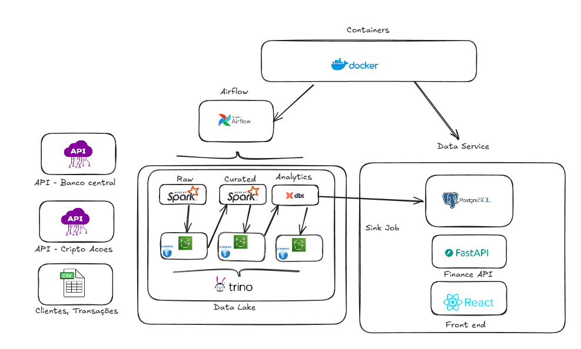

# 💰 Financial Pipeline - Data Product

**Data Product** completo para consolidação, processamento e servicing de dados financeiros. Este projeto implementa um **Data Lakehouse** com arquitetura **Medallion** (Bronze/Silver/Gold), orquestrando pipelines de ingestão, transformação e disponibilização de dados de mercado e carteiras de investimento via API.

## 🎯 Visão Geral

O Financial Pipeline é um data product end-to-end que:
- 📥 **Ingere** dados de múltiplas fontes (APIs externas, banco de dados de CRUD)
- 🔄 **Orquestra** pipelines com Airflow em ambiente containerizado
- 🏗️ **Processa** dados em 3 camadas usando PySpark e dbt
- 📊 **Transforma** dados brutos em modelos analíticos prontos para consumo
- 🔌 **Expõe** dados através de APIs e BI

## 🏗️ Arquitetura

```
┌─────────────────────────────────────────────────────────────────┐
│                        FONTES DE DADOS                           │
├──────────────────────────┬──────────────────────────────────────┤
│  APIs Externas           │  Postgres (CRUD)                      │
│  • Stocks (B3)           │  • Clientes                           │
│  • Cryptocurrencies      │  • Portfolios                         │
│  • Moedas (FX)           │  • Posições                           │
└──────────────────────────┴──────────────────────────────────────┘
                    ↓                          ↓
        ┌───────────────────────┐  ┌──────────────────────┐
        │  RAW (Iceberg)        │  │  RAW (Iceberg)       │
        │  • stocks_raw         │  │  • clients_raw       │
        │  • coins_raw          │  │  • portfolios_raw    │
        │  • crypto_raw         │  │  • positions_raw     │
        │  (preços brutos)      │  │  • transactions_raw  │
        └───────┬───────────────┘  │  (dados brutos)      │
                │                  └──────┬───────────────┘
                │ PySpark Jobs             │ PySpark Jobs
                ↓                          ↓
        ┌───────────────────────┐  ┌──────────────────────┐
        │  CURATED (Iceberg)    │  │  CURATED (Iceberg)   │
        │  • stocks_curated     │  │  • clients_curated   │
        │  • coins_curated      │  │  (limpos &           │
        │  • crypto_curated     │  │   normalizados)      │
        │  (limpos &            │  └──────┬───────────────┘
        │   normalizados)       │         │
        └───────┬───────────────┘         │
                └──────────────┬──────────┘
                               ↓
                  ┌──────────────────────────┐
                  │  GOLD (dbt + Iceberg)    │
                  │  ┌────────────────────┐  │
                  │  │  STAGING           │  │
                  │  │  • stg_clients     │  │
                  │  │  • stg_positions   │  │
                  │  │  • stg_prices      │  │
                  │  └────────────────────┘  │
                  │  ┌────────────────────┐  │
                  │  │  MARTS             │  │
                  │  │  • dim_clients     │  │
                  │  │  • dim_assets      │  │
                  │  │  • fct_positions   │  │
                  │  │  • fct_transactions│  │
                  │  │  • fct_portfolio   │  │
                  │  └────────────────────┘  │
                  └──────────┬────────────────┘
                             ↓
                         BI / APIs
```



## 📂 Estrutura do Projeto

```
financial_pipeline/
│
├── airflow/                                    # Orquestração de pipelines
│   ├── dags/
│   │   ├── clients_dag.py                     # DAG: Pipeline de clientes
│   │   ├── coins_dag.py                       # DAG: Pipeline de moedas
│   │   ├── crypto_dag.py                      # DAG: Pipeline de criptmoedas
│   │   ├── databases_sync_dag.py              # DAG: Sincronização de bancos
│   │   ├── gold_dbt_dag.py                    # DAG: Transformações dbt (Gold)
│   │   └── stocks_dag.py                      # DAG: Pipeline de ações
│   │
│   ├── logs/                                   # Logs executados pelas DAGs
│   │   ├── dag_id=clients_pipeline/
│   │   ├── dag_id=coins_pipeline/
│   │   ├── dag_id=crypto_pipeline/
│   │   ├── dag_id=database_sync/
│   │   ├── dag_id=dbt_gold_pipeline/
│   │   ├── dag_id=stocks_pipeline/
│   │   └── dag_processor/
│   │
│   ├── plugins/                                # Plugins customizados do Airflow
│   │
│   ├── config/
│   │   └── airflow.cfg                         # Configurações do Airflow
│   │
│   ├── trino/
│   │   └── catalog/                            # Configuração do catálogo Trino
│   │
│   ├── docker-compose.yaml                    # Compose para ambiente Airflow
│   ├── dockerfile                             # Docker image do Airflow
│   └── requirements.txt                       # Dependências Python Airflow
│
├── backend/                                    # API REST (FastAPI/Flask)
│   ├── docker-compose.yml                     # Compose para ambiente backend
│   ├── dockerfile                             # Docker image backend
│   ├── requirements.txt                       # Dependências Python backend
│   │
│   └── src/
│       ├── main.py                            # Aplicação principal
│       ├── api/                               # Rotas e endpoints
│       ├── core/                              # Configurações core
│       ├── models/                            # Modelos de dados
│       ├── schemas/                           # Schemas Pydantic
│       ├── services/                          # Lógica de negócio
│       └── utils/                             # Utilitários

│
├── datalake/                                   # Camada de processamento de dados
│   ├── requirements.txt                       # Dependências Python
│   │
│   ├── src/
│   │   ├── clients/                           # Pipeline de clientes (PySpark)
│   │   │   ├── raw/                           # Jobs Raw layer
│   │   │   │   ├── clients_job.py
│   │   │   │   ├── portfolios_job.py
│   │   │   │   ├── positions_job.py
│   │   │   │   └── transactions_job.py
│   │   │   └── curated/                       # Jobs Curated layer
│   │   │       └── clients_job.py
│   │   │
│   │   ├── jobs/                              # Outros pipelines PySpark
│   │   │   ├── coins/
│   │   │   ├── crypto/
│   │   │   ├── stocks/
│   │   │   └── databases_sync/
│   │   │
│   │   ├── utils/                             # Utilitários compartilhados
│   │   │
│   │   ├── seeds/                             # Geração de dados fake
│   │   │   └── fake_data.py
│   │   │
│   │   └── analytics/                         # Transformações dbt (Gold layer)
│   │       ├── dbt_project.yml                # Projeto dbt
│   │       ├── profiles.yml                   # Configuração de profiles dbt
│   │       ├── README.md                      # Documentação dbt
│   │       │
│   │       ├── models/
│   │       │   ├── staging/                   # Modelos de staging (STG)
│   │       │   └── marts/                     # Modelos de marts (FTC/DIM)
│   │       │
│   │       ├── macros/                        # Macros dbt customizadas
│   │       ├── dbt_packages/                  # Pacotes dbt instalados
│   │       ├── analyses/                      # Análises exploratórias
│   │       ├── snapshots/                     # Snapshots de dimensões
│   │       ├── tests/                         # Testes de qualidade de dados
│   │       ├── logs/                          # Logs de execução dbt
│   │       └── target/                        # Saída compilada dbt
│   │
│   ├── notebooks/
│   │   └── teste.ipynb                        # Notebooks de análise
│   │
│   ├── docs/
│   │   └── finance.excalidraw                 # Diagrama da arquitetura
│   │
│   └── logs/                                   # Logs gerais do datalake
│
├── lakehouse/                                  # Armazenamento de dados (Iceberg)
│   │
│   ├── raw/                                    # 🔴 Bronze - Dados brutos
│   │   ├── coins/                             # Tabelas raw de moedas
│   │   ├── crypto/                            # Tabelas raw de criptmoedas
│   │   ├── stocks/                            # Tabelas raw de ações
│   │   └── transactions/                      # Tabelas raw de transações
│   │
│   ├── curated/                                # 🟢 Silver - Dados limpos
│   │   ├── coins/                             # Tabelas curated de moedas
│   │   ├── crypto/                            # Tabelas curated de criptmoedas
│   │   └── stocks/                            # Tabelas curated de ações
│   │
│   └── gold/                                   # 🟡 Gold - Dados prontos
│       ├── staging/                           # Staging models (dbt)
│       ├── marts/                             # Fatos e dimensões (dbt)
│       └── [projeto_dbt]/                     # Artefatos do dbt
│
├── frontend/                                   # Interface web (opcional)
│
├── docker-compose.yml                         # Compose geral (se houver)
└── README.md                                   # Este arquivo
```

### Descrição das Camadas

| Camada | Nome | Descrição |
|--------|------|-----------|
| **Bronze** | `lakehouse/raw/` | Dados brutos importados de fontes externas (APIs, bancos) |
| **Silver** | `lakehouse/curated/` | Dados limpos, validados e normalizados via PySpark |
| **Gold** | `lakehouse/gold/` | Dados transformados em modelos analíticos prontos via dbt |

## 🚀 Como Começar

### Pré-requisitos
- Docker & Docker Compose
- Python 3.11+
- Git

### Setup

1. **Clone o repositório**
```bash
git clone https://github.com/ArthurCoutinho15/financial-pipeline.git
cd financial_pipeline
```

2. **Configure o ambiente Python**
```bash
cd datalake
python -m venv venv
source venv/bin/activate
pip install -r requirements.txt
```

3. **Inicie os containers do Airflow**
```bash
cd ../airflow
docker compose up -d
```

4. **Acesse o Airflow**
- URL: `http://localhost:8080`
- Usuário: `airflow`
- Senha: `airflow`

### Acessar PostgreSQL

O projeto possui **dois bancos PostgreSQL** para diferentes propósitos:

#### 1. **Airflow Database** (Metadados do Airflow)
- **Porta**: `5432`
- **Usuário**: `airflow`
- **Senha**: `airflow`
- **Banco**: `airflow`
- **Uso**: Armazena DAGs, execuções e logs do Airflow

#### 2. **Financial Data** (Dados de CRUD)
- **Porta**: `5433`
- **Usuário**: `financial`
- **Senha**: `financial`
- **Banco**: `financial`
- **Uso**: Dados transacionais de clientes, portfolios, posições e transações

**Como conectar via DBeaver (ou outra ferramenta):**

1. Instale o [DBeaver](https://dbeaver.io/download/)
2. Crie uma nova conexão PostgreSQL
3. Para o banco **Financial Data**, use:
   - **Server Host**: `localhost`
   - **Port**: `5433`
   - **Database**: `financial`
   - **Username**: `financial`
   - **Password**: `financial`
4. Clique em "Test Connection" para verificar
5. Pronto! Você pode explorar os dados

**Via terminal (psql):**
```bash
psql -h localhost -p 5433 -U financial -d financial
```

## 🔧 Stack Tecnológico

### Orquestração & Workflow
| Tecnologia | Versão | Uso |
|---|---|---|
| **Apache Airflow** | 2.8+ | Orquestração de DAGs e pipelines |
| **Python** | 3.11+ | Linguagem principal de desenvolvimento |

### Processamento de Dados
| Tecnologia | Versão | Uso |
|---|---|---|
| **Apache Spark** | 3.5+ | Processamento distribuído de dados |
| **PySpark** | 3.5+ | API Python para Spark |
| **dbt** | 1.5+ | Transformações SQL (camada Gold) |
| **Pandas** | 2.0+ | Manipulação de dados em memória |

### Armazenamento (Lakehouse)
| Tecnologia | Versão | Uso |
|---|---|---|
| **Apache Iceberg** | 1.6+ | Formato de tabela para o lakehouse |
| **MinIO/S3** | - | Armazenamento de objetos compatível com S3 |
| **Hadoop** | 3.3+ | Filesystem distribuído (HDFS) |

### Query & Analytics
| Tecnologia | Versão | Uso |
|---|---|---|
| **Trino** | 437+ | Query engine distribuído para SQL |
| **Hadoop Hive** | 3.1+ | Metastore para tabelas |

### Banco de Dados
| Tecnologia | Versão | Uso |
|---|---|---|
| **PostgreSQL** | 15+ | Banco de dados CRUD e metadados Airflow |
| **SQLAlchemy** | 2.0+ | ORM Python |
| **Alembic** | 1.13+ | Migrations de banco de dados |

### API & Backend
| Tecnologia | Versão | Uso |
|---|---|---|
| **FastAPI** | 0.104+ | Framework web async |
| **Uvicorn** | 0.24+ | ASGI server |
| **Pydantic** | 2.0+ | Validação de dados |
| **SQLAlchemy** | 2.0+ | ORM e conexão BD |

### DevOps & Containerização
| Tecnologia | Versão | Uso |
|---|---|---|
| **Docker** | 24+ | Containerização |
| **Docker Compose** | 2.20+ | Orquestração de containers |

### Testes & Qualidade
| Tecnologia | Versão | Uso |
|---|---|---|
| **Pytest** | 7.4+ | Framework de testes |
| **Great Expectations** | - | Data quality & validation |

### Dependências Principais (datalake)

```bash
pip install pyspark==3.5.0
pip install pandas==2.0.3
pip install sqlalchemy==2.0.21
pip install psycopg2-binary==2.9.9
pip install python-dotenv==1.0.0
pip install requests==2.31.0
pip install faker==19.6.2
```

### Dependências Principais (backend)

```bash
pip install fastapi==0.104.1
pip install uvicorn[standard]==0.24.0
pip install sqlalchemy==2.0.21
pip install psycopg2-binary==2.9.9
pip install python-dotenv==1.0.0
pip install pydantic==2.5.0
pip install pydantic-settings==2.1.0
```

## 🔄 DAGs Disponíveis

### 1. `clients_pipeline`
Orquestra o pipeline completo de clientes:
- `raw_clients` → raw layer
- `raw_portfolios` → raw layer
- `raw_positions` → raw layer
- `raw_transactions` → raw layer
- `curated_clients` → curated layer (join de todas as tabelas)

### 2. `stocks_pipeline`
Pipeline de dados de ações da B3, com backfill diário.

### 3. `coins_pipeline`
Pipeline de cotações de moedas/FX.

### 4. `crypto_pipeline`
Pipeline de criptmoedas via APIs públicas.

## 🛠️ Estrutura PySpark (Reader/Writer/Client)

O projeto implementa abstrações para interação com o Iceberg através do Spark.

### SparkClient - Gerenciador de Sessão Spark

O `SparkClient` mantém uma sessão única de Spark configurada para trabalhar com Iceberg:

```python
from pipelines.spark_client import SparkClient

# Criar instância do client
spark_client = SparkClient(app_name="financial_pipeline", warehouse="s3://my-warehouse")

# Obter sessão Spark
spark = spark_client.get_session()
```

**Funcionalidades:**
- 🔗 Configuração automática de conexão Iceberg
- 📦 Carregamento de JARs necessários (Iceberg, AWS SDK)
- 🔄 Gerenciamento de sessão singleton (uma única instância)
- ☁️ Suporte a S3 e REST catalogs

**Variáveis de ambiente:**
```bash
ICEBERG_REST_URI=http://localhost:8182          # URI do catálogo REST Iceberg
SPARK_WAREHOUSE_PATH=s3://my-warehouse          # Caminho do warehouse
AWS_ACCESS_KEY_ID=xxx                           # Credenciais AWS
AWS_SECRET_ACCESS_KEY=xxx
```

### SparkReader - Leitura de Dados

O `SparkReader` fornece métodos para ler dados das tabelas Iceberg com tratamento inteligente de datas:

```python
from pipelines.spark_reader import SparkReader
from pipelines.models.reader import ReaderConfig, EnumReadMode

reader = SparkReader()

# Configurar leitura
config = ReaderConfig(
    source_table="raw.stocks_raw",
    target_table="curated.stocks_curated",
    dt_column="date",
    read_mode=EnumReadMode.INCREMENTAL,
    lookback_days=7
)

# Ler dados com configuração
df = reader.get_data(config)
```

**Métodos principais:**

| Método | Descrição | Exemplo |
|--------|-----------|---------|
| `_read_table(table_name)` | Lê tabela completa | `reader._read_table("raw.stocks_raw")` |
| `_get_last_processed_data(table, col)` | Obtém última data processada | `reader._get_last_processed_data("curated.stocks", "date")` |
| `get_data(config)` | Lê dados com configuração inteligente | `reader.get_data(config)` |

**Modos de leitura (EnumReadMode):**
- `FULL`: Lê todos os dados da tabela
- `INCREMENTAL`: Lê apenas dados novos desde última execução
- `RANGE`: Lê dados em intervalo de datas

### SparkWriter - Escrita de Dados

O `SparkWriter` fornece métodos para escrever dados em tabelas Iceberg com suporte a diferentes estratégias de merge:

```python
from pipelines.spark_writer import SparkWriter
from pipelines.models.writer import WriterConfig, EnumIngestionMode, EnumMergeStrategy

writer = SparkWriter()

# Configurar escrita
config = WriterConfig(
    target_table="curated.stocks_curated",
    ingestion_mode=EnumIngestionMode.UPSERT,
    merge_strategy=EnumMergeStrategy.UPDATE_INSERT,
    partition_cols=["year", "month"]
)

# Escrever dados
writer.write(df_transformed, config)
```

**Métodos principais:**

| Método | Descrição | Uso |
|--------|-----------|-----|
| `_create_table()` | Cria tabela Iceberg | Automático na primeira escrita |
| `_append()` | Append de dados | `EnumIngestionMode.APPEND` |
| `_upsert()` | Update + Insert (Merge) | `EnumIngestionMode.UPSERT` |
| `write()` | Escrita inteligente | Detecta modo automaticamente |

**Estratégias de Merge (EnumMergeStrategy):**
- `APPEND_ONLY`: Apenas adiciona novos registros
- `UPDATE_INSERT`: Atualiza registros existentes ou insere novos
- `DELETE_INSERT`: Deleta e re-insere (full refresh)
- `SCD2`: Slowly Changing Dimensions tipo 2

**Exemplo de pipeline completo:**

```python
from pipelines.spark_reader import SparkReader
from pipelines.spark_writer import SparkWriter
from pipelines.models.reader import ReaderConfig, EnumReadMode
from pipelines.models.writer import WriterConfig, EnumIngestionMode

class StocksJob:
    def __init__(self, date: str):
        self.date = date
        self.reader = SparkReader()
        self.writer = SparkWriter()
    
    def run(self):
        # Ler dados incrementais
        config_read = ReaderConfig(
            source_table="raw.stocks_raw",
            dt_column="date",
            read_mode=EnumReadMode.INCREMENTAL,
            lookback_days=7
        )
        df = self.reader.get_data(config_read)
        
        # Transformar dados
        df_transformed = df.select("id", "symbol", "price", "date")
        
        # Escrever com upsert
        config_write = WriterConfig(
            target_table="curated.stocks_curated",
            ingestion_mode=EnumIngestionMode.UPSERT,
            partition_cols=["date"]
        )
        self.writer.write(df_transformed, config_write)
```

## 📡 API Backend (FastAPI)

A API REST fornece acesso aos dados financeiros através de endpoints estruturados.

### Arquitetura da API

```
src/
├── main.py                                    # Aplicação FastAPI
├── core/
│   ├── configs.py                             # Configurações globais
│   └── dependencies.py                        # Injeção de dependências
│
├── api/
│   └── v1/
│       ├── api.py                             # Router principal v1
│       └── routes/
│           ├── analytics.py                   # Endpoints de analytics
│           ├── clients.py                     # Endpoints de clientes
│           ├── portfolios.py                  # Endpoints de portfolios
│           ├── positions.py                   # Endpoints de posições
│           └── transactions.py                # Endpoints de transações
│
├── models/                                    # Modelos de banco de dados (SQLAlchemy)
│
├── schemas/                                   # Schemas Pydantic (validação/serialização)
│
├── services/                                  # Lógica de negócio
│
└── utils/                                     # Funções auxiliares
```

### Como Iniciar a API

```bash
# Instalar dependências
pip install -r requirements.txt

# Rodar em desenvolvimento
python src/main.py

# Ou com uvicorn diretamente
uvicorn src.main:app --host 0.0.0.0 --port 8000 --reload
```

**URL base**: `http://localhost:8000/api/v1`

### Documentação Interativa

A API inclui documentação automática através do Swagger UI:
- **Swagger UI**: `http://localhost:8000/docs`
- **ReDoc**: `http://localhost:8000/redoc`

### Endpoints Disponíveis

#### 📊 Analytics
```
GET  /api/v1/analytics/portfolio-summary
GET  /api/v1/analytics/positions-by-asset
GET  /api/v1/analytics/returns-analysis
GET  /api/v1/analytics/risk-metrics
```

#### 👥 Clientes
```
GET    /api/v1/clients                        # Listar clientes
GET    /api/v1/clients/{client_id}            # Obter cliente por ID
POST   /api/v1/clients                        # Criar novo cliente
PUT    /api/v1/clients/{client_id}            # Atualizar cliente
DELETE /api/v1/clients/{client_id}            # Deletar cliente
```

#### 💼 Portfolios
```
GET    /api/v1/portfolios                     # Listar portfolios
GET    /api/v1/portfolios/{portfolio_id}      # Obter portfolio
POST   /api/v1/portfolios                     # Criar portfolio
PUT    /api/v1/portfolios/{portfolio_id}      # Atualizar portfolio
GET    /api/v1/portfolios/{id}/positions      # Listar posições do portfolio
```

#### 📈 Posições
```
GET    /api/v1/positions                      # Listar posições
GET    /api/v1/positions/{position_id}        # Obter posição
POST   /api/v1/positions                      # Criar posição
PUT    /api/v1/positions/{position_id}        # Atualizar posição
GET    /api/v1/positions/{id}/history         # Histórico de mudanças
```

#### 💸 Transações
```
GET    /api/v1/transactions                   # Listar transações
GET    /api/v1/transactions/{transaction_id}  # Obter transação
POST   /api/v1/transactions                   # Registrar transação
GET    /api/v1/transactions/by-client/{id}    # Transações por cliente
```

### Exemplo de Uso da API

**Obter lista de clientes:**
```bash
curl -X GET http://localhost:8000/api/v1/clients \
  -H "Content-Type: application/json"
```

**Criar novo cliente:**
```bash
curl -X POST http://localhost:8000/api/v1/clients \
  -H "Content-Type: application/json" \
  -d '{
    "name": "João Silva",
    "email": "joao@example.com",
    "phone": "(11) 98765-4321"
  }'
```

**Obter posições de um portfolio:**
```bash
curl -X GET http://localhost:8000/api/v1/portfolios/123/positions \
  -H "Content-Type: application/json"
```

### Modelos de Dados

#### Client
```python
{
  "id": "uuid",
  "name": "string",
  "email": "string",
  "phone": "string",
  "created_at": "datetime",
  "updated_at": "datetime"
}
```

#### Portfolio
```python
{
  "id": "uuid",
  "client_id": "uuid",
  "name": "string",
  "description": "string",
  "total_value": "float",
  "created_at": "datetime",
  "updated_at": "datetime"
}
```

#### Position
```python
{
  "id": "uuid",
  "portfolio_id": "uuid",
  "asset_type": "stock|crypto|coin",
  "asset_symbol": "string",
  "quantity": "float",
  "average_price": "float",
  "current_price": "float",
  "total_value": "float",
  "created_at": "datetime",
  "updated_at": "datetime"
}
```

#### Transaction
```python
{
  "id": "uuid",
  "position_id": "uuid",
  "type": "buy|sell",
  "quantity": "float",
  "price": "float",
  "total": "float",
  "date": "date",
  "created_at": "datetime"
}
```

## � DAGs e Execução

### 1. `clients_pipeline`
Orquestra o pipeline completo de clientes:
- `raw_clients` → raw layer (ingestão do PostgreSQL)
- `raw_portfolios` → raw layer
- `raw_positions` → raw layer
- `raw_transactions` → raw layer
- `curated_clients` → curated layer (join consolidado)

**Schedule**: Diário às 02:00 UTC
**Timeout**: 30 minutos

### 2. `stocks_pipeline`
Pipeline de dados de ações da B3 com backfill diário.

**Schedule**: Diário às 03:00 UTC
**Fontes**: APIs de preços de ações

### 3. `coins_pipeline`
Pipeline de cotações de moedas/FX.

**Schedule**: A cada 6 horas
**Fontes**: APIs de cotações de moedas

### 4. `crypto_pipeline`
Pipeline de criptmoedas via APIs públicas.

**Schedule**: A cada 12 horas
**Fontes**: CoinGecko, Binance, etc.

### 5. `databases_sync_dag`
Sincronização de dados do PostgreSQL para o Iceberg.

**Schedule**: Diário às 01:00 UTC
**Tabelas**: clients, portfolios, positions, transactions

### 6. `gold_dbt_dag`
Executa transformações dbt na camada Gold.

**Schedule**: Diário às 05:00 UTC
**Modelos**: Staging e Marts

A camada `gold` utiliza **dbt** para transformações SQL com:
- Staging models (limpeza adicional)
- Mart models (fatos e dimensões)
- Testes de data quality
- Documentação automática

```bash
cd datalake/src/dbt

# Rodar models
dbt run

# Rodar testes
dbt test

# Gerar documentação
dbt docs generate
```

## � Trino - Query Engine

**Trino** é um distributed query engine que permite consultar dados diretamente do Iceberg com SQL padrão.

### Acessar o Trino UI

1. Abra o navegador: `http://localhost:8080` (Trino Web UI)
2. Você pode executar queries SQL diretamente na interface

### Conectar via DBeaver ou Outras Ferramentas

**Configuração de Conexão:**
- **Host:** `localhost`
- **Port:** `8080`
- **Database/Catalog:** `hadoop_catalog`
- **Schema:** `raw`, `curated` ou `gold`
- **Username:** (deixar vazio ou usar `trino`)
- **Password:** (deixar vazio)
- **Driver:** Trino JDBC

### Exemplos de Queries

```sql
-- Listar todos os catálogos
SHOW CATALOGS;

-- Listar schemas
SHOW SCHEMAS FROM hadoop_catalog;

-- Listar tabelas
SHOW TABLES FROM hadoop_catalog.raw;

-- Query básica - Clientes com portfolios
SELECT 
    client_id,
    name,
    email,
    portfolio_id,
    portfolio_name,
    ticker,
    asset_type,
    transaction_quantity,
    transaction_price_brl,
    dt_transaction
FROM hadoop_catalog.curated.clients
WHERE dt_reference = CURRENT_DATE
LIMIT 100;

-- Análise de posições por cliente
SELECT 
    client_id,
    name,
    COUNT(DISTINCT portfolio_id) as num_portfolios,
    COUNT(DISTINCT position_id) as num_posicoes,
    SUM(transaction_quantity * transaction_price_brl) as valor_total
FROM hadoop_catalog.curated.clients
WHERE dt_reference = CURRENT_DATE
GROUP BY client_id, name;
```

### Conectar via Linha de Comando

```bash
# Usando trino-cli
trino --server localhost:8080 --catalog hadoop_catalog --schema raw
```

### Configuração no docker-compose.yaml

O Trino está configurado para acessar:
- **Iceberg Catalog**: Tabelas Ray/Curated/Gold
- **Conector S3**: Acesso aos dados no S3/MinIO
- **REST Catalog**: Integração com Iceberg REST server

## �📋 Estrutura de Dados

### Raw Tables
- `hadoop_catalog.raw.clients` - Dados brutos de clientes
- `hadoop_catalog.raw.portfolios` - Dados brutos de portfolios
- `hadoop_catalog.raw.positions` - Dados brutos de posições
- `hadoop_catalog.raw.transactions` - Histórico de transações

### Curated Tables
- `hadoop_catalog.curated.clients` - Clientes com portfolios, posições e transações consolidadas

### Gold Tables (via dbt)
- `hadoop_catalog.gold.dim_clients` - Dimensão de clientes
- `hadoop_catalog.gold.dim_assets` - Dimensão de ativos
- `hadoop_catalog.gold.fct_positions` - Fato de posições atualizadas
- `hadoop_catalog.gold.fct_transactions` - Fato de transações históricas

## 🧪 Testes

```bash
# Rodar suite de testes
cd datalake
pytest tests/

# Rodar com coverage
pytest --cov=src tests/
```

## Gerar dados fake

```bash
python src/seeds/fake_data.py --output csv
```

## 🐛 Troubleshooting

### Problema: Airflow não inicia

**Solução:**
```bash
# Limpar volumes antigos
docker compose down -v

# Reiniciar fresh
docker compose up -d

# Verificar logs
docker compose logs airflow-webserver
```

### Problema: Erro de conexão com PostgreSQL

**Verificar:**
```bash
# Verificar se container está rodando
docker ps | grep postgres

# Testar conexão
psql -h localhost -p 5433 -U financial -d financial -c "SELECT 1"
```

### Problema: Spark job falha com erro de Iceberg

**Causas comuns:**
- Catálogo Iceberg não está rodando
- Tabela não existe (criar com `CREATE TABLE IF NOT EXISTS`)
- Permissões de S3/MinIO incorretas

**Solução:**
```bash
# Verificar REST URI está acessível
curl http://localhost:8182/v1/config

# Verificar MinIO está rodando
curl http://localhost:9000/minio/health/live
```

### Problema: dbt compile falha

**Verificar:**
```bash
cd datalake/src/analytics

# Validar profiles.yml
dbt debug

# Limpar e recompilar
rm -rf target/
dbt parse
```

### Problema: Sem acesso a arquivos do Airflow

**Solução:**
```bash
# Dar permissões corretas
chmod -R 777 ./airflow/logs
chmod -R 777 ./airflow/plugins

# Executar como mesmo usuário
docker compose exec airflow-webserver ls -la /opt/airflow/dags
```

## 📝 Logs e Monitoramento

Logs dos diferentes componentes:

| Componente | Localização | Comando |
|---|---|---|
| **Airflow WebServer** | UI: http://localhost:8080 | `docker compose logs airflow-webserver` |
| **Airflow Scheduler** | `./airflow/logs/` | `docker compose logs airflow-scheduler` |
| **Spark Jobs** | Spark UI: http://localhost:4040 | Logs do container |
| **API Backend** | Console | `docker compose logs backend` |
| **dbt** | `./datalake/src/analytics/logs/` | `dbt debug -v` |

## 📊 Dashboards & UIs

| Ferramenta | URL | Descrição |
|---|---|---|
| **Airflow** | http://localhost:8080 | Orquestração de DAGs |
| **Spark Master** | http://localhost:8080 | Status dos jobs Spark |
| **MinIO** | http://localhost:9001 | Gerenciamento de S3 |
| **Trino** | http://localhost:8080 | Query interface |
| **API Docs** | http://localhost:8000/docs | Swagger UI da API |
| **API ReDoc** | http://localhost:8000/redoc | ReDoc da API |

## 🚀 Comandos Úteis

### Airflow
```bash
# Listar DAGs
docker compose exec airflow-webserver airflow dags list

# Rodar DAG manualmente
docker compose exec airflow-webserver airflow dags trigger clients_pipeline

# Listar tasks de uma DAG
docker compose exec airflow-webserver airflow dags test clients_pipeline 2024-01-01
```

### Spark
```bash
# Submeter job Spark
spark-submit --master spark://localhost:7077 datalake/src/jobs/stocks/main.py
```

### dbt
```bash
# Rodar modelos dbt
cd datalake/src/analytics && dbt run

# Rodar testes dbt
cd datalake/src/analytics && dbt test

# Gerar docs dbt
cd datalake/src/analytics && dbt docs generate
```

### API
```bash
# Teste de API
curl -X GET http://localhost:8000/api/v1/clients

# Teste com jq (pretty print)
curl -s http://localhost:8000/api/v1/clients | jq
```

### Docker
```bash
# Ver todos os containers
docker ps -a

# Ver logs em tempo real
docker compose logs -f [service_name]

# Executar comando em um container
docker compose exec [service_name] [command]
```

## ✅ Health Checks

```bash
# Verificar saúde de todos os serviços
docker compose ps

# Testar conectividade Iceberg
curl -s http://localhost:8182/v1/config | jq

# Testar conectividade Trino
trino --server localhost:8080 --catalog hadoop_catalog --schema raw --execute "SELECT 1"

# Testar API
curl -s http://localhost:8000/api/v1/clients | jq
```

## 📚 Boas Práticas

### Para Pipelines PySpark

1. **Sempre usar ReaderConfig e WriterConfig**
   ```python
   # ✅ BOM
   config = ReaderConfig(source_table=..., read_mode=EnumReadMode.INCREMENTAL)
   df = reader.get_data(config)
   
   # ❌ RUIM
   df = spark.read.table("table")
   ```

2. **Particionar dados por data**
   ```python
   WriterConfig(
       target_table="curated.stocks",
       partition_cols=["year", "month"]
   )
   ```

3. **Usar transformações lazy do Spark**
   - Evitar `collect()` sem necessidade
   - Usar `filter()` e `select()` antes de ações

### Para DAGs Airflow

1. **Use XComs para passar dados entre tasks**
   ```python
   ti.xcom_push(key='processed_date', value=date.today())
   date = ti.xcom_pull(task_ids='previous_task', key='processed_date')
   ```

2. **Sempre defina `depends_on_past`** quando houver dependência
   ```python
   Task(depends_on_past=True, wait_for_downstream=True)
   ```

3. **Use pools para limitar concorrência**
   ```python
   Task(pool='spark_jobs', pool_slots=1)
   ```

### Para Banco de Dados

1. **Sempre use prepared statements/ORM** para evitar SQL injection
2. **Crie índices** em colunas frequentemente consultadas
3. **Faça backup regular** dos dados CRUD

## 📖 Documentação Detalhada

- [**Documentação dbt**](datalake/src/analytics/README.md) - Modelos de dados Gold
- [**Arquitetura**](datalake/docs/finance.excalidraw) - Diagrama da solução
- [**Dados Fake**](datalake/src/seeds/README.md) - Geração de dados de teste

## 👤 Autor

**Arthur Coutinho**  
Portfolio: https://github.com/ArthurCoutinho15

## 📄 Licença

MIT - Use livremente em seus projetos!
